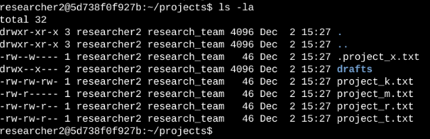
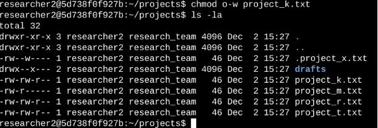
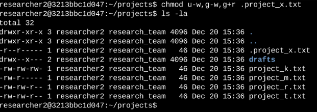
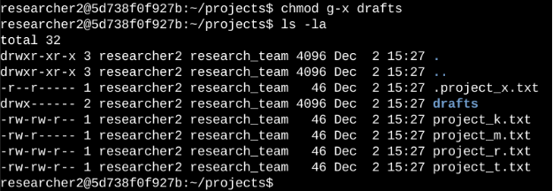

# File permissions in Linux
## Project description
The research team at my organization needs to update the file permissions for certain files and directories within the projects directory. The permissions do not currently reflect the level of authorization that should be given. Checking and updating these permissions will help keep their system secure. To complete this task, I performed the following tasks:
Check file and directory details
The following code demonstrates how I used Linux commands to determine the existing permissions set for a specific directory in the file system.

The first line of the screenshot displays the command I entered, and the other lines display the output. The code lists all contents of the projects directory. I used the ls command with the -la option to display a detailed listing of the file contents that also returned hidden files. The output of my command indicates that there is one directory named drafts, one hidden file named .project_x.txt, and five other project files. The 10-character string in the first column represents the permissions set on each file or directory.
## Describe the permissions string
The 10-character string can be deconstructed to determine who is authorized to access the file and their specific permissions. The characters and what they represent are as follows:
* 1st character: This character is either a d or hyphen (-) and indicates the file type. If it’s a d, it’s a directory. If it’s a hyphen (-), it’s a regular file.
* 2nd-4th characters: These characters indicate the read (r), write (w), and execute (x) permissions for the user. When one of these characters is a hyphen (-) instead, it indicates that this permission is not granted to the user.
* 5th-7th characters: These characters indicate the read (r), write (w), and execute (x) permissions for the group. When one of these characters is a hyphen (-) instead, it indicates that this permission is not granted for the group.
* 8th-10th characters: These characters indicate the read (r), write (w), and execute (x) permissions for other. This owner type consists of all other users on the system apart from the user and the group. When one of these characters is a hyphen (-) instead, that indicates that this permission is not granted for other.

For example, the file permissions for project_t.txt are -rw-rw-r--. Since the first character is a hyphen (-), this indicates that project_t.txt is a file, not a directory. The second, fifth, and eighth characters are all r, which indicates that user, group, and other all have read permissions. The third and sixth characters are w, which indicates that only the user and group have write permissions. No one has execute permissions for project_t.txt.
## Change file permissions
TBased on the audit, I found that project_k.txt had write permissions enabled for others, which went against the organization's access policy.

The following code demonstrates how I used Linux commands to do this:

To correct this, I used the chmod command to remove write access from the "other" user category. After applying the change, I re-ran ls -la to confirm that the updated permissions correctly reflected the restricted access. This helped ensure that only authorized users could modify the file.
## Change file permissions on a hidden file
The hidden file .project_x.txt had recently been archived, and the team wanted to ensure it was protected from modification. The requirement was that no one—neither user, group, nor others—should have write access, but both the user and group should retain read access.

The following code demonstrates how I used Linux commands to change the permissions:

To implement this, I used a series of chmod commands: first to remove write permissions from the user and group, then to explicitly reassign read access to the group. This sequence allowed me to apply fine-grained control over the file's accessibility while preserving visibility for authorized team members.
## Change directory permissions
Restricting access to the drafts directory was another important task, as it contained sensitive project materials meant only for the researcher2 user.

The following code demonstrates how I used Linux commands to change the permissions:

The output here displays the permission listing for several files and directories. Line 1 indicates the current directory (projects), and line 2 indicates the parent directory (home). Line 3 indicates a regular file titled .project_x.txt. Line 4 is the directory (drafts) with restricted permissions. Here you can see that only researcher2 has execute permissions.  It was previously determined that the group had execute permissions, so I used the chmod command to remove them. The researcher2 user already had execute permissions, so they did not need to be added.
## Summary
Throughout this task, I reviewed and modified file and directory permissions using standard Linux commands to enforce security best practices. I began by auditing the existing settings with ls -la, which provided a clear overview of access levels across the projects directory. Based on these findings, I used chmod to update permissions on individual files and directories, ensuring that access was limited to the appropriate users and groups.

